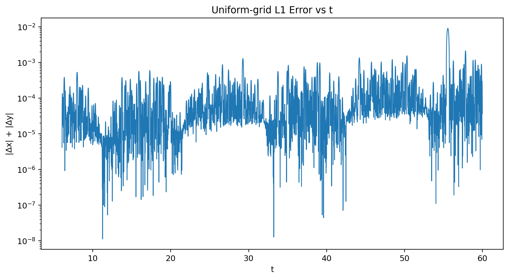
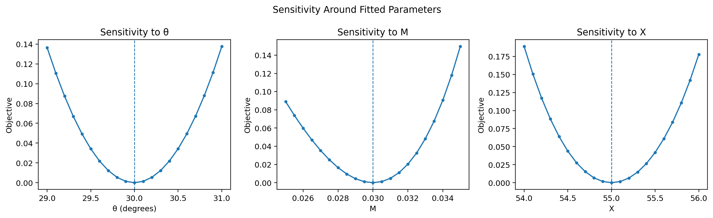

# Parametric Curve Fitting — R&D Assignment

Recover the unknown parameters `θ`, `M`, and `X` from an unordered set of `(x, y)` points.

The curve is:

```text
x(t) = t·cos(θ) − e^(M|t|)·sin(0.3t)·sin(θ) + X
y(t) = 42 + t·sin(θ) + e^(M|t|)·sin(0.3t)·cos(θ)

6 < t < 60
```

## Final Answer

| Parameter |        Value |         Constraint |
| --------- | -----------: | -----------------: |
| `θ`       | **30.0000°** |     `0° < θ < 50°` |
| `M`       |   **0.0300** | `−0.05 < M < 0.05` |
| `X`       |  **55.0000** |      `0 < X < 100` |

### Desmos

[Open fitted curve in Desmos](https://www.desmos.com/calculator/jjcufejdax)

## Approach

### 1. Rewrite the curve

Let

```text
A(t) = t
B(t) = e^(M|t|) · sin(0.3t)
```

Then

```text
x - X = A cos(θ) - B sin(θ)
y - 42 = A sin(θ) + B cos(θ)
```

This is a rotation followed by a translation.

### 2. Undo the rotation

For a candidate `(θ, X)`:

```text
t_est = (x - X) cos(θ) + (y - 42) sin(θ)

B_est = -(x - X) sin(θ) + (y - 42) cos(θ)
```

For the correct parameters:

```text
B_est ≈ e^(M|t_est|) · sin(0.3t_est)
```

This reduces the problem to a bounded 3-parameter fit over `θ`, `M`, and `X`.

## Optimization

The implementation:

1. Recovers `t_est` and `B_est` using the inverse rotation.
2. Minimizes the transformed-coordinate residual.
3. Penalizes `t_est` values outside `6 < t < 60`.
4. Runs 60 bounded nonlinear least-squares starts.
5. Uses differential evolution as an independent cross-check.

The different optimization runs converge to the same parameter region.

## Validation

The final score is evaluated separately using the assignment's uniform-grid L1 metric.

The observed points are ordered by recovered `t`, interpolated onto a uniform `t` grid, and compared with the fitted analytical curve:

```text
L1(t) = |x_pred(t) - x_obs(t)| + |y_pred(t) - y_obs(t)|
```

For the supplied dataset:

```text
Mean uniform-grid L1 : 0.0001744963
Max  uniform-grid L1 : 0.0090396116
P95  uniform-grid L1 : 0.0005913611
```

Validation is implemented in `src/verify_fit.py`.

## Results

### Fitted Curve


### L1 Residual



### Parameter Sensitivity



## Desmos Equation

The fitted equation is:

```text
(
t·cos(0.523599)
− e^(0.03|t|)·sin(0.3t)·sin(0.523599) + 55,

42
+ t·sin(0.523599)
+ e^(0.03|t|)·sin(0.3t)·cos(0.523599)
)
```

with:

```text
6 ≤ t ≤ 60
```

The same equation is stored in:

`results/desmos_equation.txt`

## Reproduce

```bash
git clone https://github.com/Prianshu7296/Flam-RnD-Assignment.git
cd Flam-RnD-Assignment

pip install -r requirements.txt

python src/fit_curve.py
python src/verify_fit.py
python src/plot_fit.py
```

## Repository Structure

```text
Flam-RnD-Assignment/
├── README.md
├── requirements.txt
├── .gitignore
│
├── data/
│   └── xy_data.csv
│
├── src/
│   ├── fit_curve.py
│   ├── verify_fit.py
│   └── plot_fit.py
│
└── results/
    ├── fit_result.txt
    ├── validation.txt
    ├── desmos_equation.txt
    ├── fit_plot.png
    ├── residual_vs_t.png
    └── sensitivity.png
```

## Notes

The input points are unordered and the original `t` values are not required as an output.

Final recovered parameters:

```text
θ = 30°
M = 0.03
X = 55
```

