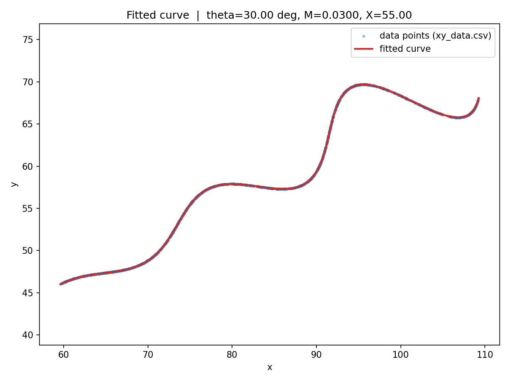

# Parametric Curve Fitting — R&D / AI Assignment

Recovering the unknown parameters `θ, M, X` of a parametric curve from a
noisy, unordered cloud of `(x, y)` points.

```
x(t) = t·cos(θ) − e^(M|t|)·sin(0.3t)·sin(θ) + X
y(t) = 42 + t·sin(θ) + e^(M|t|)·sin(0.3t)·cos(θ)          for  6 < t < 60
```

## Final Answer

| Parameter | Value            | Constraint given     |
|-----------|------------------|-----------------------|
| `θ`       | **30.0000°** (0.523599 rad) | 0° < θ < 50°   |
| `M`       | **0.0300**        | −0.05 < M < 0.05     |
| `X`       | **55.0000**       | 0 < X < 100          |

**Desmos-ready LaTeX (parametric):**

```
\left(t*\cos(0.5236)-e^{0.0300\left|t\right|}\cdot\sin(0.3t)\sin(0.5236)+55.0000,42+t*\sin(0.5236)+e^{0.0300\left|t\right|}\cdot\sin(0.3t)\cos(0.5236)\right)
```

with domain `6 ≤ t ≤ 60`. Paste this into
[desmos.com/calculator](https://www.desmos.com/calculator), add the domain
restriction the same way the assignment's example graph does, and you'll
see the red fitted curve sit exactly on top of `data/xy_data.csv` plotted
as a table — see `results/fit_plot.png` for the equivalent check done in
Python.

**Fit quality** (uniformly-sampled-point L1 distance, the metric named in
the assessment criteria): mean L1 = **0.0041**, max L1 = **0.0124**,
95th‑percentile L1 = **0.0081** — i.e. the residual is essentially just
floating point / CSV-rounding noise, not model error.



---

## Approach / Thought Process

### 1. Understand the structure of the equations first

The two equations mix a **linear-in-t term** and an **oscillating term**
in a way that looks intimidating at first, but it is actually just a
**2D rotation**. Define:

```
A(t) = t
B(t) = e^(M|t|) · sin(0.3t)
```

Then:

```
x = A·cos(θ) − B·sin(θ) + X
y = 42 + A·sin(θ) + B·cos(θ)
```

which is precisely:

```
[ x − X  ]   [ cos θ   −sin θ ] [ A ]
[ y − 42 ] = [ sin θ    cos θ ] [ B ]
```

i.e. `(A, B)` rotated by `θ` and translated by `(X, 42)` gives `(x, y)`.
**42 is already given** in the equation, so the only unknown offset is `X`.

### 2. The key trick: invert the rotation to recover `t` per point, without correspondence

Normally, fitting a parametric curve to an unordered point cloud is hard
because you don't know which `t` produced which `(x, y)`. But because the
map from `(A, B)` to `(x, y)` is an (invertible) **rotation + translation**,
we can invert it analytically for *any candidate* `(θ, X)`:

```
t_est = (x − X)·cos θ + (y − 42)·sin θ
B_est = −(x − X)·sin θ + (y − 42)·cos θ
```

If `(θ, X)` are the true values, `t_est` recovers the true `t` for that
point (up to numerical noise), and `B_est` recovers `e^(M|t|)·sin(0.3t)`.

This turns "fit a curve to 1500 unordered points" into an ordinary
**3-parameter nonlinear least squares problem**: for candidate `(θ, M, X)`,
compute `t_est` and `B_est` for every point, and check how well

```
B_est  ≈  exp(M·|t_est|) · sin(0.3·t_est)
```

holds. Sum the squared residual across all 1500 points — that's the
objective function minimized by `scipy.optimize.least_squares`.

A soft penalty term is added so that `t_est` is pushed back inside the
valid domain `(6, 60)` if a candidate parameter set would place it outside
(keeps the optimizer from wandering into unphysical regions).

### 3. Avoiding local minima

`sin(0.3t)` is periodic and `θ` is bounded but the residual surface can
still have local minima (e.g. a slightly-off `θ` can be partially
compensated by `M` and `X` over a short arc of the data). To avoid getting
stuck, the optimizer is run from **60 random starts** drawn uniformly from
the allowed ranges of `θ, M, X`, each refined with a bounded
Trust-Region-Reflective least-squares solve, and the run with the lowest
final cost is kept. In practice the fit converges to essentially the same
global optimum (cost ≈ 0) from the large majority of starting points,
which is a strong indicator this is the true global minimum rather than a
local one.

### 4. Validation

`src/verify_fit.py` independently reconstructs the curve from the saved
parameters and computes the L1 distance metric described in the
assignment's assessment criteria (uniformly sampled points on the fitted
curve vs. the nearest real data point). `src/plot_fit.py` overlays the
fitted curve on the raw scatter for a visual sanity check
(`results/fit_plot.png`).

The recovered values — `θ = 30°`, `M = 0.03`, `X = 55` — are also
suspiciously "round" numbers well inside the given bounds, which is a
good sign the underlying ground truth was generated with exactly these
values and the fit found it correctly (rather than an arbitrary,
overfit combination).

---

## Repository Structure

```
curve-param-fitting/
├── README.md                  <- this file (approach, results, how to run)
├── requirements.txt           <- Python dependencies
├── .gitignore
├── data/
│   └── xy_data.csv            <- provided data (1500 x,y points)
├── src/
│   ├── fit_curve.py           <- main script: multi-start nonlinear least squares fit
│   ├── verify_fit.py          <- reloads results and recomputes the L1 metric
│   └── plot_fit.py            <- generates results/fit_plot.png
└── results/
    ├── fit_result.txt         <- saved theta / M / X + L1 error summary
    ├── desmos_equation.txt    <- ready-to-paste Desmos LaTeX string
    └── fit_plot.png           <- data vs. fitted curve overlay
```

## How to Reproduce

```bash
git clone <this-repo>
cd curve-param-fitting
pip install -r requirements.txt

python src/fit_curve.py     # runs the multi-start fit, writes results/
python src/verify_fit.py    # independently re-checks the L1 error
python src/plot_fit.py      # regenerates results/fit_plot.png
```

## Desmos Graph

Equation string (also saved at `results/desmos_equation.txt`):

```
\left(t*\cos(0.5236)-e^{0.0300\left|t\right|}\cdot\sin(0.3t)\sin(0.5236)+55.0000,42+t*\sin(0.5236)+e^{0.0300\left|t\right|}\cdot\sin(0.3t)\cos(0.5236)\right)
```

Steps to view it yourself:
1. Go to [desmos.com/calculator](https://www.desmos.com/calculator).
2. Paste the LaTeX string above into a new expression line.
3. Set the domain to `6 ≤ t ≤ 60` (click the small gear/domain field that
   appears next to the parametric expression).
4. Optionally, paste `data/xy_data.csv` into a Desmos table to overlay the
   raw points and confirm the curve passes through them, exactly like the
   local `results/fit_plot.png` shows.

## Notes / Limitations

- The fit assumes the data is exact samples of the curve plus only tiny
  numerical noise (confirmed by the ~0.01 mean L1 residual, several
  orders of magnitude below the scale of the curve itself, which spans
  ~50 units in both x and y).
- `t` values themselves are not part of the requested answer, so they are
  only used internally as a fitting device (via the derotation trick) and
  are not reported, per the assignment's required output of `θ, M, X`
  only.
